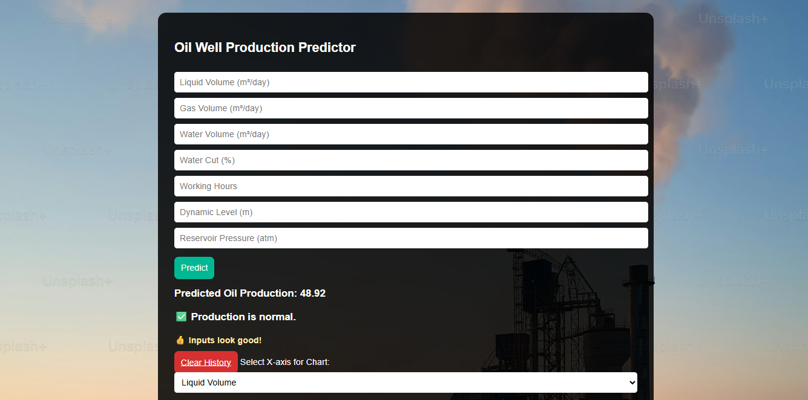
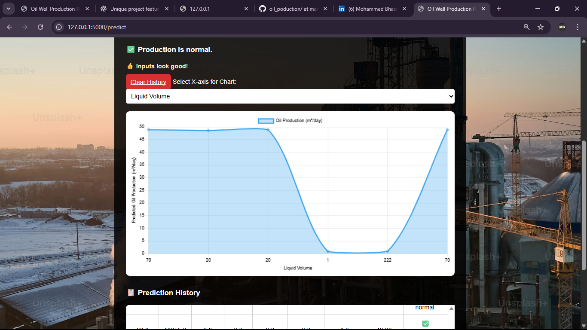
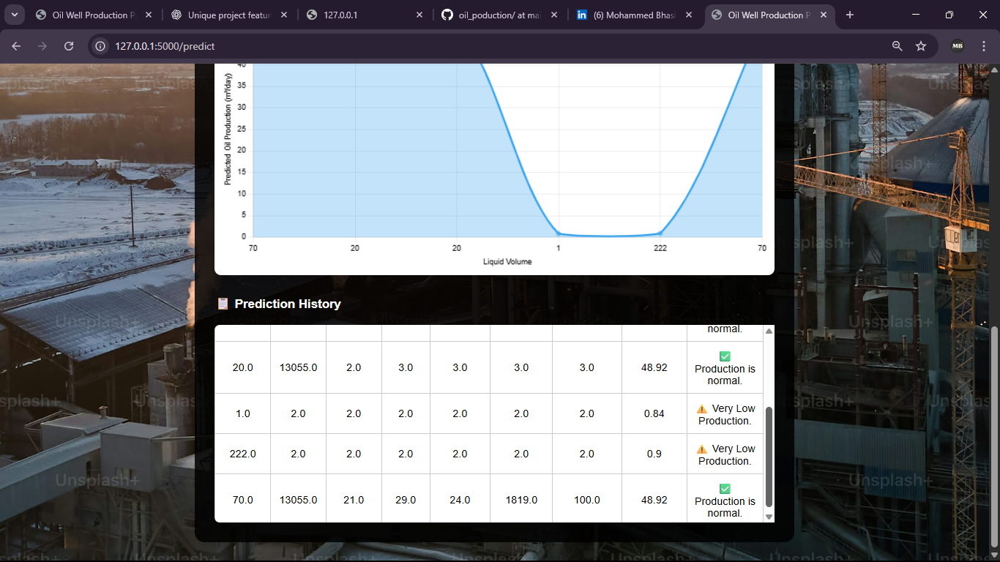

# 🛢️ Oil Well Production Prediction System

This project is a Machine Learning-powered web application that predicts oil well production output based on operational parameters. Designed for energy sector use cases, the tool provides real-time predictions, anomaly detection, and smart suggestions to optimize well performance.

---

## 🚀 Features

- 🔍 **Oil Production Prediction** using Random Forest ML model
- 📊 **Interactive Graphs** to visualize production trends
- 📋 **Scrollable History Table** showing previous inputs and results
- 🧠 **Anomaly Detection** for identifying low or high production issues
- 💡 **Smart Suggestions** to help improve performance based on input
- 🌐 **Deployed using Flask** with clean UI and responsive design

---

## 📸 Screenshot

  
  
  

> _(Optional: Add a real screenshot of your app here)_

---

## 🧠 Technologies Used

| Area        | Tech Stack                |
|-------------|---------------------------|
| Frontend    | HTML5, CSS3, Chart.js     |
| Backend     | Python, Flask             |
| ML Model    | Random Forest (Pickle)    |
| Visualization | Chart.js                |
| Storage     | CSV file (`predictions.csv`) |

---

## 🧪 Model Inputs

| Input Parameter         | Description                          |
|-------------------------|--------------------------------------|
| Liquid Volume (m³/day)  | Total liquid produced per day        |
| Gas Volume (m³/day)     | Gas produced                         |
| Water Volume (m³/day)   | Water content in output              |
| Water Cut (%)           | Water percentage in production       |
| Working Hours           | Daily operation hours                |
| Dynamic Level (m)       | Fluid level in well                  |
| Reservoir Pressure (atm)| Well pressure                        |

---

## 🔍 Anomaly Detection Logic

- **Very Low Production** (< 10): Alerts with suggestions like increasing liquid volume or reducing water cut
- **Normal Production** (10–300): Marked as stable
- **Unusually High Production** (> 300): Warns about possible incorrect inputs like extreme gas volume or pressure

---

## 📂 Project Structure
├── app.py # Main Flask app
├── clean_random_forest_model.pkl # Trained ML model
├── predictions.csv # Stores input/output history
├── templates/
│ └── index.html # Frontend interface
├── static/
│ └── bg.jpg # Background image
└── README.md # You're here

Author
Mohammed Bhasith
👨‍🎓 AIML Engineer | 💻 Python & ML Developer
📫 Reach me: LinkedIn: www.linkedin.com/in/bhasith
